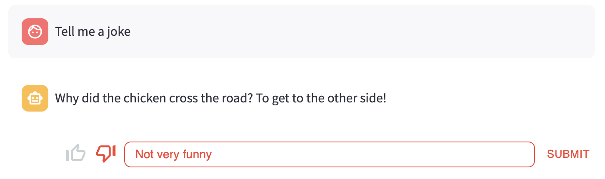
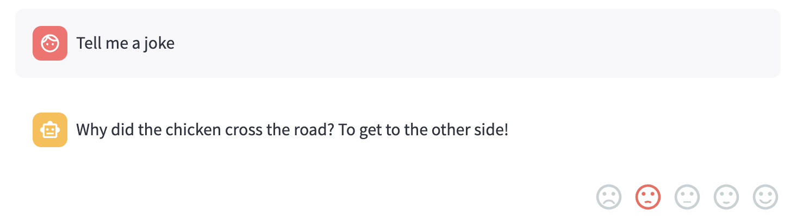
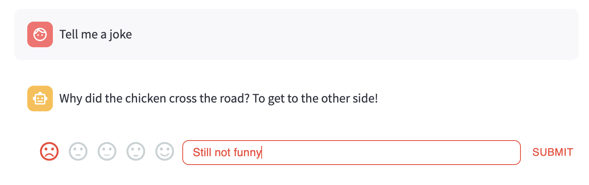
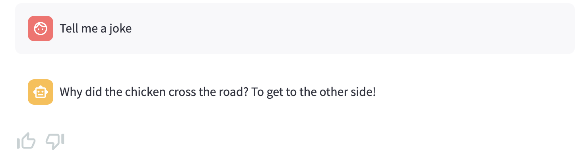

# streamlit-feedback

Here is a Streamlit component that allows you to **collect user feedback** in your apps.

## Install

```sh
pip install streamlit-feedback
```

## Examples

- [Trubrics](https://github.com/trubrics/trubrics-sdk), enabling AI teams to collect, analyse and manage user feedback on their models:

    - [LLM Chat Completion](https://trubrics-llm-example-chatbot.streamlit.app/): A chatbot that queries OpenAI's API and allows users to leave feedback.
    - [LLM Completion](https://trubrics-llm-example.streamlit.app/): An LLM app that queries OpenAI's API and allows users to leave feedback on single text generations.
    - [Titanic](https://trubrics-titanic-example.streamlit.app/): An app that allows users to give feedback on a classifier that predicts whether passengers will survive the titanic.

- *Raise a PR with your cool feedback example here!*

## Usage

This component holds a single function:

```python
from streamlit_feedback import streamlit_feedback
feedback = streamlit_feedback(feedback_type="thumbs")
feedback
```


It can be used with these parameters:

```python
def streamlit_feedback(
    feedback_type,
    optional_text_label=None,
    single_submit=True,
    align="flex-end",
    key=None,
):
    """
    Parameters
    ----------
    feedback_type: str
        The type of feedback; "thumbs" or "faces".
    optional_text_label: str or None
        An optional label to add as a placeholder to the textbox.
        If None, the "thumbs" or "faces" will not be accompanied by textual feedback.
    single_submit: bool
        Disables re-submission. This prevents users re-submitting feedback for a given prediction e.g. for a chatbot.
    align: str
        Where to align the feedback component; "flex-end", "center" or "flex-start".
    key: str or None
        An optional key that uniquely identifies this component. If this is
        None, and the component's arguments are changed, the component will
        be re-mounted in the Streamlit frontend and lose its current state.

    Returns
    -------
    dict
        The user response, with the feedback_type, score and text fields.
    """
```

For a full example integrated in a chatbot, scroll down to the bottom of [this script](streamlit_feedback/__init__.py).

Here are some more examples:

```python
from streamlit_feedback import streamlit_feedback
feedback = streamlit_feedback(
    feedback_type="thumbs",
    optional_text_label="[Optional] Please provide an explanation",
)
feedback
```



---

```python
from streamlit_feedback import streamlit_feedback
feedback = streamlit_feedback(feedback_type="faces")
feedback
```



---

```python
from streamlit_feedback import streamlit_feedback
feedback = streamlit_feedback(
    feedback_type="faces",
    optional_text_label="[Optional] Please provide an explanation",
)
feedback
```



---

```python
from streamlit_feedback import streamlit_feedback
feedback = streamlit_feedback(feedback_type="thumbs", align="flex-start")
feedback
```


